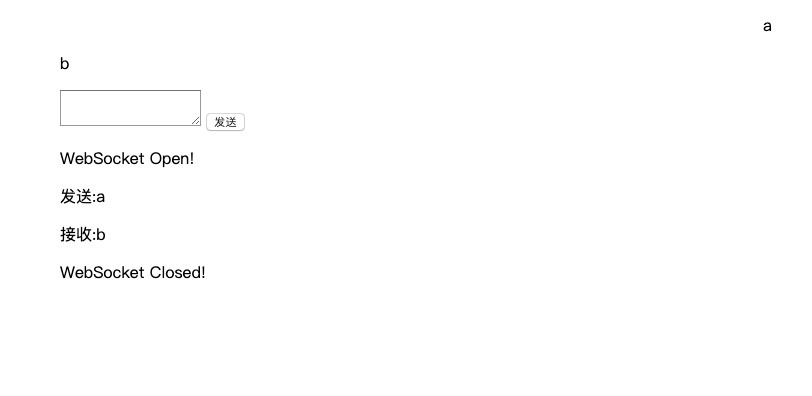
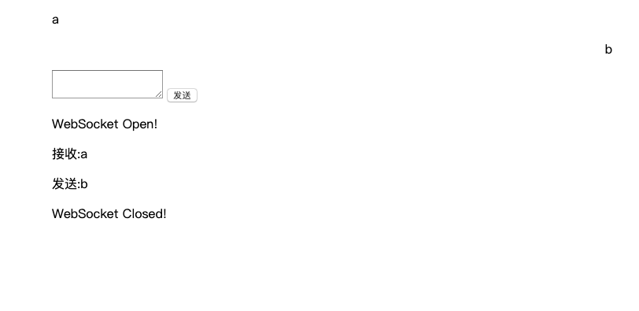

# 基于 Swoole(WebSocket) 实现简易IM
## 快速使用

- php>=7.0.0
- 安装Redis
- 安装Swoole 扩展

```
https://github.com/devchen-org/swoole-im.git
cd swoole-im
composer install
```

- Nginx

```
upstream websocket {
    server 127.0.0.1:9501 weight=1;
    server 127.0.0.1:9502 weight=1;
    ip_hash;
}

map $http_upgrade $connection_upgrade {
    default upgrade;
    '' close;
}

server {
    listen 8080;
    server_name swoole-im.local;
    location / {
        proxy_pass http://websocket;
        proxy_http_version 1.1;
        proxy_set_header Upgrade $http_upgrade;
        proxy_set_header Connection "upgrade";
    }
}
```
- 运行

```
php artisan im:server start
```

## 演示

`tests/websocket.html`


